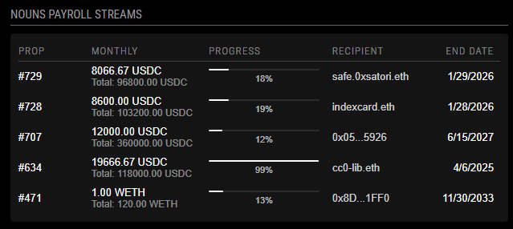

# MMM-NounsStream

A [MagicMirror²](https://github.com/MichMich/MagicMirror) module to display Nouns DAO payroll streams. This module shows active streams with their progress, monthly amounts, and recipients.

## Screenshot


## Features
- Displays active Nouns DAO payroll streams
- Shows stream progress with visual progress bars
- Displays monthly and total amounts
- Supports both USDC and WETH streams
- Resolves ENS names for recipient addresses
- Auto-updates at configurable intervals

## Installation

```bash
cd ~/MagicMirror/modules
git clone https://github.com/XppaiCyberr/MMM-NounsStream
cd MMM-NounsStream
npm install
```

## Configuration

Add the following configuration to your `config/config.js` file:

```javascript
{
    module: "MMM-NounsStream",
    position: "top_right",
    config: {
        updateInterval: 5 * 60 * 1000, // Update every 5 minutes
        rpcUrl: "YOUR_ETHEREUM_RPC_URL", // Required: Ethereum RPC URL
        showAllStreams: true,           // Optional: Show all streams or just active ones
        maxStreams: 6,                  // Optional: Maximum number of streams to display
        showHeader: true,               // Optional: Show/hide the header
        headerText: "Nouns Payroll Streams" // Optional: Custom header text
    }
}
```

### Configuration Options

| Option | Description | Default |
|--------|-------------|---------|
| `updateInterval` | How often to update the stream data (in milliseconds) | `300000` (5 minutes) |
| `rpcUrl` | Your Ethereum RPC URL (required) | `""` |
| `showAllStreams` | Whether to show all streams or just active ones | `true` |
| `maxStreams` | Maximum number of streams to display | `6` |
| `showHeader` | Whether to show the header | `true` |
| `headerText` | Custom text for the header | `"Nouns Payroll Streams"` |

## Dependencies
- [ethers](https://docs.ethers.org/v6/) - For Ethereum interaction

## Updating

```bash
cd ~/MagicMirror/modules/MMM-NounsStream
git pull
npm install
```

## Contributing
Contributions are welcome! Please feel free to submit a Pull Request.

## License
MIT Licensed 